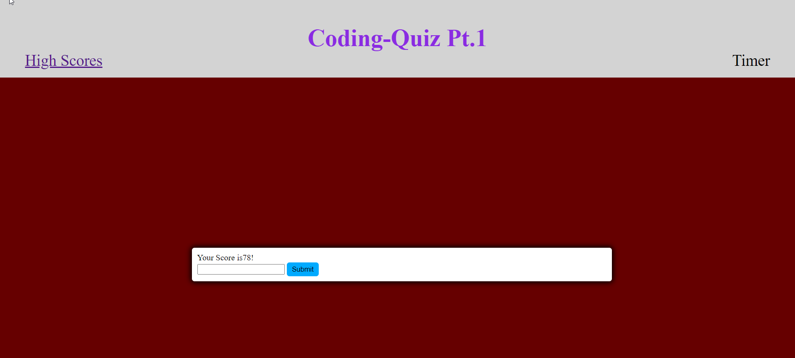

# Code-Quiz

## Description
This is a 5 question quiz on basic javascript. It has fun functionality such as keeping highscores and the background changing color's whether your answer is correct or wrong.

## Installation
https://christopherponzio.github.io/Code-Quiz
https://github.com/ChristopherPonzio/Code-Quiz
## Usage
Here is a screen shot showing that when you select an answer it will change the background based on if the answer is correct or wrong.

## Credits
1. Michelle Blackwell github: https://github/Mblackwellgca
2. https://www.youtube.com/watch?v=riDzcEQbX6k

## License
No License